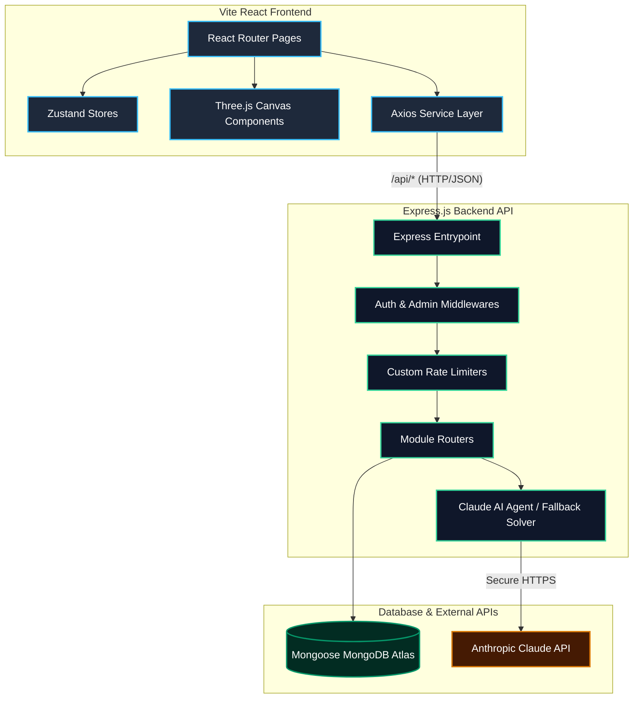

# ⚡ Macros Nutrition
### *Premium Sports Nutrition + Generative AI Fitness Technology*

<p align="center">
  <a href="https://nodejs.org/">
    
  </a>
  <a href="https://react.dev/">
    
  </a>
  <a href="https://vite.dev/">
    
  </a>
  <a href="https://www.mongodb.com/">
    
  </a>
  <a href="https://www.anthropic.com/">
    
  </a>
</p>

---

🚀 **Live Deployment:** [https://macros-nutrition.netlify.app/](https://macros-nutrition.netlify.app/)

---

## 📖 Table of Contents
1. [🏢 What This Business Is](#-what-this-business-is)
2. [✨ Key Product Features](#-key-product-features)
   - [Customer Experience](#customer-experience)
   - [Admin Experience](#admin-experience)
3. [🏗 Monorepo Architecture & Data Flow](#-monorepo-architecture--data-flow)
4. [🛠 Tech Stack Matrix](#-tech-stack-matrix)
5. [🗄 Database Architecture & Schemas](#-database-architecture--schemas)
6. [🔌 API Endpoints Reference](#-api-endpoints-reference)
7. [🤖 AI Coach & Simulation Fallback](#-ai-coach--simulation-fallback)
8. [🚀 Local Development & Setup](#-local-development--setup)
9. [🔒 GitHub Publishing & Security Checklist](#-github-publishing--security-checklist)
10. [👥 Team & Contribution](#-team--contribution)

---

## 🏢 What This Business Is

**Macros Nutrition** is a premium Indian sports nutrition brand designed to bridge the gap between high-performance supplements and science-led fitness tracking:
* **🔬 Clean, Certified Formulas:** Elite supplements verified free of heavy metals, amino spiking, and artificial filler ingredients.
* **📐 Science-Led Biometrics:** Tailored nutrition planning utilizing the Mifflin-St Jeor equation for target caloric and macronutrient calculation.
* **🎒 Goal-Oriented Stacks:** Supplement combinations optimized for specific performance profiles (e.g., muscle building, recovery, clean fat loss).
* **🖥 Elite Digital Presentation:** High-fidelity 3D modeling, kinetic typography, and fluid micro-interactions for a premium storefront feel.

---

## ✨ Key Product Features

### Customer Experience
* 🧊 **Interactive 3D Catalog:** Features a high-fidelity 3D whey protein tub mesh inside [HeroCanvas.jsx](file:///Users/harshmishra/Desktop/Macros%20Nutrition%20Website/client/src/components/three/HeroCanvas.jsx) powered by React Three Fiber with custom lighting and hover physics.
* 📊 **AI Fitness Coach:** An interactive portal in [AiCoachPage.jsx](file:///Users/harshmishra/Desktop/Macros%20Nutrition%20Website/client/src/pages/AiCoachPage.jsx) that calculates exact energy expenditure (TDEE), sets custom macro splits, and outputs visual progress tracking charts.
* 📦 **Goal Stack Builder:** Rapid bundle configuration in [StackBuilderPage.jsx](file:///Users/harshmishra/Desktop/Macros%20Nutrition%20Website/client/src/pages/StackBuilderPage.jsx) for users to build curated bundles (e.g., *Muscle Hypertrophy*, *Fat Loss*, *Sustained Endurance*).
* 🛒 **Secured Cart & Checkout:** Persistent state-managed shopping cart inside [CartPage.jsx](file:///Users/harshmishra/Desktop/Macros%20Nutrition%20Website/client/src/pages/CartPage.jsx) with price-verification security.
* ⭐ **Verified Athlete Reviews:** Real-time customer ratings with verified purchase status tags verified against order logs in [Review.js](file:///Users/harshmishra/Desktop/Macros%20Nutrition%20Website/server/models/Review.js).

### Admin Experience
* 🔐 **Secure Admin Portal:** Restricted, role-protected interface in [AdminDashboard.jsx](file:///Users/harshmishra/Desktop/Macros%20Nutrition%20Website/client/src/pages/AdminDashboard.jsx) with comprehensive order tracking, fulfillment updates, and stock indicators.
* 🌱 **Database Seeder System:** A robust system in [seeder.js](file:///Users/harshmishra/Desktop/Macros%20Nutrition%20Website/server/seeder.js) to programmatically spin up or reset a clean catalog and default administrative profile in seconds.

---

## 🏗 Monorepo Architecture & Data Flow



### The Customer Cycle
1. **Interactive Discovery:** The visitor views premium 3D graphics in [HomePage.jsx](file:///Users/harshmishra/Desktop/Macros%20Nutrition%20Website/client/src/pages/HomePage.jsx).
2. **AI Consultation:** The user enters physical biometrics in [AiCoachPage.jsx](file:///Users/harshmishra/Desktop/Macros%20Nutrition%20Website/client/src/pages/AiCoachPage.jsx).
3. **Target Optimization:** The system computes macro goals and visualizes stack suggestions.
4. **Fulfillment Cycle:** Authenticated users check out, adding orders to MongoDB via [Order.js](file:///Users/harshmishra/Desktop/Macros%20Nutrition%20Website/server/models/Order.js).
5. **Verified Verification:** Users leave verified product ratings inside [reviews.js](file:///Users/harshmishra/Desktop/Macros%20Nutrition%20Website/server/routes/reviews.js).

---

## 🛠 Tech Stack Matrix

| Layer | Technology | File Context / Implementation | Purpose |
| :--- | :--- | :--- | :--- |
| **Frontend Framework** | React 18 / Vite | [package.json](file:///Users/harshmishra/Desktop/Macros%20Nutrition%20Website/client/package.json) | High performance development and builds |
| **3D Rendering Engine**| Three.js / R3F | [components/three/](file:///Users/harshmishra/Desktop/Macros%20Nutrition%20Website/client/src/components/three) | WebGL canvas integration for supplement renders |
| **State Management**  | Zustand | [store/](file:///Users/harshmishra/Desktop/Macros%20Nutrition%20Website/client/src/store) | Client states for authentication, cart, and styling |
| **Animations**         | Framer Motion / GSAP | [pages/HomePage.jsx](file:///Users/harshmishra/Desktop/Macros%20Nutrition%20Website/client/src/pages/HomePage.jsx) | Fluid entry effects and smooth Lenis page-scrolling |
| **Data Visualization** | Recharts | [pages/AiCoachPage.jsx](file:///Users/harshmishra/Desktop/Macros%20Nutrition%20Website/client/src/pages/AiCoachPage.jsx) | Nutrient target distribution charts |
| **Backend Server**     | Node.js / Express.js | [server.js](file:///Users/harshmishra/Desktop/Macros%20Nutrition%20Website/server/server.js) | Structured routing, middleware pipelines |
| **Object Modeling**    | Mongoose / MongoDB | [models/](file:///Users/harshmishra/Desktop/Macros%20Nutrition%20Website/server/models) | Schema structure for database collections |
| **Session Control**    | JWT / Bcryptjs | [middleware/auth.js](file:///Users/harshmishra/Desktop/Macros%20Nutrition%20Website/server/middleware/auth.js) | Secure cookie token sessions and hashing |
| **Generative AI**      | Anthropic Claude API | [routes/ai.js](file:///Users/harshmishra/Desktop/Macros%20Nutrition%20Website/server/routes/ai.js) | Claude-powered responses and stack builder |

---

## 🗄 Database Architecture & Schemas

The application database uses Mongoose with 7 structural models:

### 1. User Model ([User.js](file:///Users/harshmishra/Desktop/Macros%20Nutrition%20Website/server/models/User.js))
Stores user profiles, access tokens, and pointers to current progress targets:
* `name` (String, required)
* `email` (String, required, unique)
* `password` (String, hashed, select: false)
* `role` (String, enum: `['customer', 'admin']`, default: `'customer'`)
* `wishlist` (Array of ObjectId references to `Product`)
* `nutritionPlan` (ObjectId reference to `NutritionPlan`)

### 2. Product Model ([Product.js](file:///Users/harshmishra/Desktop/Macros%20Nutrition%20Website/server/models/Product.js))
Tracks items in the catalog including their macronutrient splits and sizing profiles:
* `name`, `slug` (String, unique, indexed)
* `category` (String, required)
* `goals` (Array of Strings for filtering)
* `flavors` (Array: `name`, `colorHex`, `kcal`, `inStock`)
* `sizes` (Array: `weight` e.g., "1kg", `price`, `mrp`)
* `shortDesc`, `description`, `ingredients` (Strings)
* `macros`: `{ protein, carbs, fat, calories, servingSize }`
* `rating`, `reviewCount`, `salesCount` (Number tracking)

### 3. Order Model ([Order.js](file:///Users/harshmishra/Desktop/Macros%20Nutrition%20Website/server/models/Order.js))
Records purchase history, transactional totals, and shipment logs:
* `user` (ObjectId reference to `User`)
* `orderItems` (Array of objects specifying product ref, flavor, size, qty, and unit price)
* `shippingAddress` (Address lines, city, postal code, country)
* `paymentMethod`, `paymentResult` (Transaction tracking)
* `itemsPrice`, `taxPrice`, `shippingPrice`, `totalPrice` (Financial numbers)
* `isPaid`, `paidAt`, `isDelivered`, `deliveredAt` (Fulfillment trackers)

### 4. Review Model ([Review.js](file:///Users/harshmishra/Desktop/Macros%20Nutrition%20Website/server/models/Review.js))
Holds product reviews and filters verified purchasers:
* `product`, `user` (ObjectIds, required refs)
* `name` (Author displayName)
* `rating` (Number, 1 to 5)
* `comment` (String, required)
* `verifiedPurchase` (Boolean, flags matching purchases)

### 5. Nutrition Plan Model ([NutritionPlan.js](file:///Users/harshmishra/Desktop/Macros%20Nutrition%20Website/server/models/NutritionPlan.js))
Retains the outputs of the AI Biometric Coach for dashboards:
* `user` (ObjectId ref, optional for guest setups)
* `biometrics`: `{ age, gender, heightCm, weightKg, goal, activityLevel }`
* `macros`: `{ calories, protein, carbs, fat, tdee }`
* `stack` (Array of ObjectId references to `Product`)

### 6. Weight & Macro Trackers ([WeightLog.js](file:///Users/harshmishra/Desktop/Macros%20Nutrition%20Website/server/models/WeightLog.js) & [MacroLog.js](file:///Users/harshmishra/Desktop/Macros%20Nutrition%20Website/server/models/MacroLog.js))
Allows progressive weight logs and caloric calculations:
* `user` (ObjectId ref)
* `weight` / `calories` / `protein` (Logged values)
* `date` (Timestamp)

---

## 🔌 API Endpoints Reference

### Authentication Router ([auth.js](file:///Users/harshmishra/Desktop/Macros%20Nutrition%20Website/server/routes/auth.js))
* `POST /api/auth/register` — Registers new credentials.
* `POST /api/auth/login` — Verifies passwords and registers an HTTP-only JWT token.
* `GET /api/auth/me` — Decodes token and returns active session data. *(Auth Protected)*
* `POST /api/auth/logout` — Invalidates cookie session.

### Products Catalog ([products.js](file:///Users/harshmishra/Desktop/Macros%20Nutrition%20Website/server/routes/products.js))
* `GET /api/products` — Returns catalog items. Supports query parameters for `category`, `goal`, `search`, and `sort` (featured, newest, priceAsc, priceDesc).
* `GET /api/products/:idOrSlug` — Returns product details matching ID or string slug.
* `POST /api/products` — Registers a new catalog product. *(Admin Protected)*
* `PUT /api/products/:id` — Modifies product schemas. *(Admin Protected)*
* `DELETE /api/products/:id` — Removes catalog products. *(Admin Protected)*

### Orders Pipeline ([orders.js](file:///Users/harshmishra/Desktop/Macros%20Nutrition%20Website/server/routes/orders.js))
* `POST /api/orders` — Submits a checkout order. Server compares prices against MongoDB data to block tampering. *(Auth Protected)*
* `GET /api/orders/mine` — Fetches logs for the logged-in user. *(Auth Protected)*
* `GET /api/orders` — Returns all active orders. *(Admin Protected)*
* `PUT /api/orders/:id/status` — Updates order delivery status. *(Admin Protected)*

### AI Coach & Stacks ([ai.js](file:///Users/harshmishra/Desktop/Macros%20Nutrition%20Website/server/routes/ai.js) & [stack.js](file:///Users/harshmishra/Desktop/Macros%20Nutrition%20Website/server/routes/stack.js))
* `POST /api/ai/nutrition` — Submits biometrics to calculate targets and generate stacks. *(Rate limited to 15 req/15 min)*
* `POST /api/ai/save-plan` — Saves biometric calculators output to User profiles. *(Auth Protected)*
* `POST /api/ai/chat` — Feeds interactive coach questions into Anthropic Claude. *(Rate limited)*
* `GET /api/stack/:goal` — Returns curated local bundles by goal category.

---

## 🤖 AI Coach & Simulation Fallback

To support local setups without requiring active Anthropic subscription credentials, the app switches dynamically depending on whether an `ANTHROPIC_API_KEY` is present.

### Biometric Target Equation
The mathematical algorithm evaluates active user inputs using the **Mifflin-St Jeor Formula**:

$$\text{BMR (Male)} = 10 \times \text{weight (kg)} + 6.25 \times \text{height (cm)} - 5 \times \text{age (y)} + 5$$

$$\text{BMR (Female)} = 10 \times \text{weight (kg)} + 6.25 \times \text{height (cm)} - 5 \times \text{age (y)} - 161$$

$$\text{TDEE} = \text{BMR} \times \text{Activity Coefficient}$$

Target limits are adjusted automatically based on target goals:
* 📉 **Fat Loss:** Caloric reduction of $500\text{ kcal/day}$
* 📈 **Muscle Gain:** Caloric surplus of $350\text{ kcal/day}$
* ⚖️ **Maintenance:** Equates exactly to calculated TDEE

### Chat Automation Fallback
If the API key is not configured, a local regex-based fallback module evaluates keywords (`creatine`, `whey`, `fat loss`) and resolves dynamic, contextual replies immediately with zero network delay.

---

## 🚀 Local Development & Setup

Follow these commands to get your local environment running:

### 1. Clone & Download Dependencies
Install nested dependencies across the backend and frontend modules:
```bash
npm run install-all
```

### 2. Configure Local Settings
Create an environment file under [server/.env](file:///Users/harshmishra/Desktop/Macros%20Nutrition%20Website/server/.env):
```env
PORT=5050
MONGO_URI=mongodb://127.0.0.1:27017/macros-nutrition
JWT_SECRET=your_super_secret_session_key
ANTHROPIC_API_KEY=your_anthropic_api_key_here
NODE_ENV=development
```
*(Leave the `ANTHROPIC_API_KEY` empty to run using the built-in local fallback solver)*

### 3. Load Catalog Seeds
Drop existing data tables and populate a test database catalog with default products:
```bash
npm run seed
```

### 4. Boot Up Servers
Launch frontend and backend servers concurrently:
```bash
npm run dev
```
* **Storefront client:** Access [http://localhost:5173](http://localhost:5173) in your browser.
* **Server health check:** Check [http://localhost:5050/api/products](http://localhost:5050/api/products) inside any API tool.

---

## 🔒 GitHub Publishing & Security Checklist

Prior to hosting or moving the codebase online, verify this checklist:

> [!CAUTION]
> **Environment Protection**
> Never publish `.env` files to public folders. The root [.gitignore](file:///Users/harshmishra/Desktop/Macros%20Nutrition%20Website/.gitignore) is configured to exclude this, but double check before making a git commit.

> [!WARNING]
> **Production Credentials**
> The seeding script inside [seeder.js](file:///Users/harshmishra/Desktop/Macros%20Nutrition%20Website/server/seeder.js) creates a testing admin profile with the login credentials `admin@macros.in` and `admin12345`.
> **DO NOT** seed your live production database with these values. Update the seeding parameters to use production secret environment variables.

> [!TIP]
> **CORS Configurations**
> In production, change the `ALLOWED_ORIGINS` setup inside [server.js](file:///Users/harshmishra/Desktop/Macros%20Nutrition%20Website/server/server.js) to target your live Netlify storefront domain instead of generic localhost ports.

---

## 👥 Team & Contribution

This project was built and designed as a collaborative effort:

* 🏋️‍♂️ **Harsh Mishra**
* 🧠 **Pratima Vankhade**
* ⚡ **Yash Khapre**
* 🎨 **Armaan Mulani**

### Contributing Guidelines
Contributions are welcome! If you'd like to extend features (e.g. Stripe checkout flows, visual interactive charts, or custom API endpoints), feel free to open a Pull Request.

---

## 📄 License
This project is currently unlicensed. Add a `LICENSE` file if you plan to define usage rights for the open-source community.

